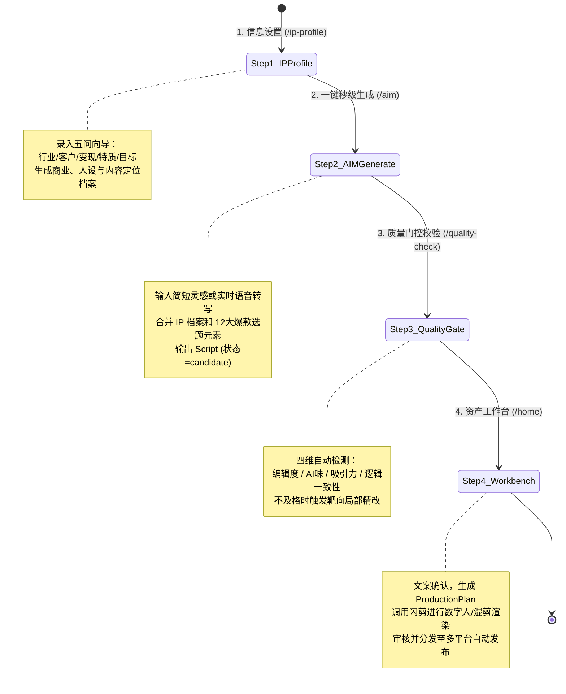
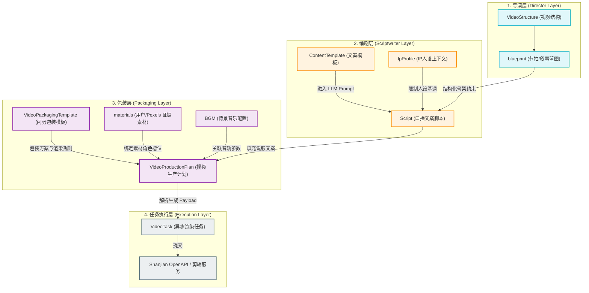
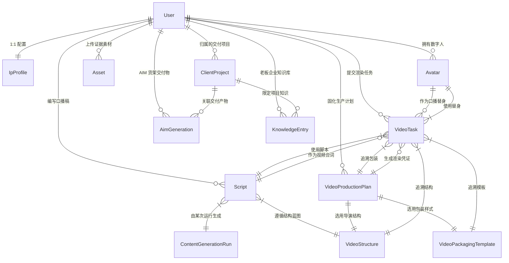
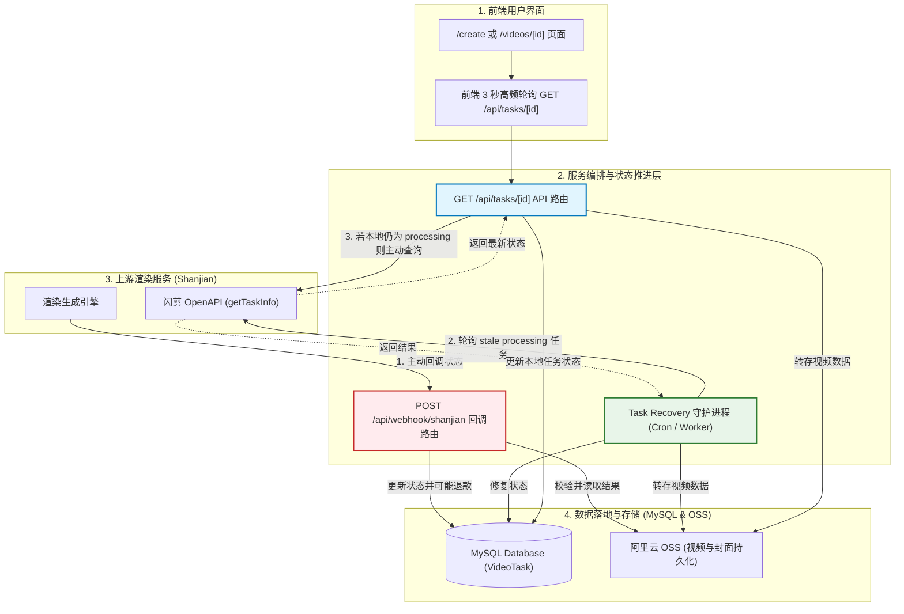

> **⚠️ OUTDATED — 项目已重命名为明远AIM（mingyuan），本文中的 Mermaid 图和路径引用已过时。** 保留仅作历史参考。

# ClipFlow 系统架构与代码地图（代码图示手册 · 历史）

本手册旨在通过精细化的 **Mermaid 架构图与时序图**，为开发人员和 AI 智能体直观地梳理 ClipFlow 的整体工程边界、业务逻辑流、数据库表结构和异步任务架构。

---

## 1. 业务逻辑：4步黄金流水线与状态转移图

ClipFlow 遵循 **Direction A（AIM 一键生成为核心）** 架构。原本独立的 `/topic-planning` 与 `/copywriting` 已被移出菜单，收拢为 `/aim` 下的底层引擎，形成精简的 4 步黄金流：

---

## 2. 系统建模：视频生成三层架构关系图

系统将视频的创建过程明确解耦为 **导演层 (Director)**、**编剧层 (Scriptwriter)** 与 **包装层 (Packaging)**，以防这三者的数据模型与接口契约在运行时发生混淆。

---

## 3. 数据库结构：Prisma 核心实体 ER 关联图

根据 [schema.prisma](file:///Users/xiangyu/Desktop/明动aim智能体/clipflow/apps/web/prisma/schema.prisma) 整理的实体关系模型，帮助理解核心资产的归属和流转血缘（Lineage）：

---

## 4. 异步处理：视频状态收敛的“四通道”合并图

为了防范闪剪平台回调丢失以及网络抖动，系统并非只依赖 Webhook，而是通过四种通道并发地收敛视频任务状态，保障资产的安全落库：

> **架构警示 (Hard Rules)**:
> 1. **超扣风险**: 并发高时，`GET /api/tasks/[id]` 与 Webhook 状态冲突极易造成积分扣减/退款竞争，必须警惕原子性保障。
> 2. **转存安全**: OSS 转存如果失败，不要静默使用闪剪的临时链接（24小时失效），应提供降级报警。
