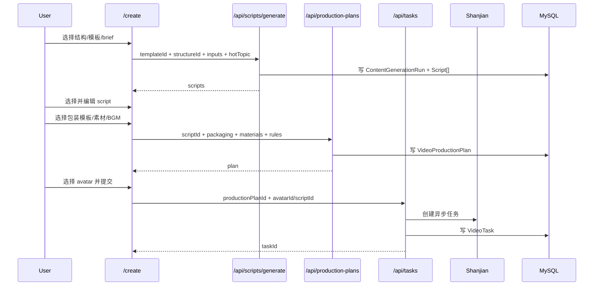
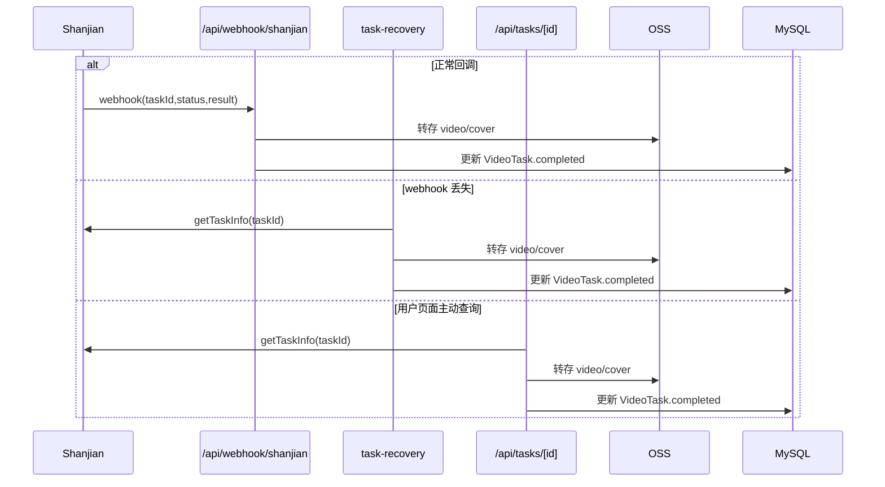

# 视频生成工作流架构与技术实现 Review

更新日期：2026-03-23

## 1. 文档目的

这份文档不是产品设想稿，而是基于当前仓库实现，对 明远AIM 视频生成工作流做的一份”实现态架构说明 + 技术评审 + 演进建议”。

核心目标：

- 说明当前视频生成工作流到底是怎么跑的
- 区分“已经实现的真实链路”和“OpenSpec 里的目标链路”
- 识别工作流里最关键的架构风险、数据一致性风险和产品体验断点
- 给出后续迭代时应该坚持的审美标准与验收条件

## 2. 执行摘要

当前系统已经具备一条可跑通的视频生产闭环，但它不是一个完全统一、单态的生产系统，而是三套能力叠加出来的混合架构：

1. 前端工作台层
`apps/web/src/app/(dashboard)/create/page.tsx`

2. 服务编排层
`/api/scripts/generate`、`/api/production-plans`、`/api/tasks`、`/api/webhook/shanjian`、`/api/cron/poll-tasks`

3. 基础设施层
MySQL/Prisma、Redis、阿里云 OSS、闪剪 OpenAPI、LLM Provider、K8s web/worker

当前最重要的架构判断：

- 产品表层已经进入“三层创作工作台”模式，但真正被 UI 暴露的主路径仍然几乎只有 `virtualman_broadcast`
- 后端已经具备通用异步任务引擎，支持 9 种视频任务类型，但前端工作台没有把这些能力真正编排成多分支产品
- 任务完成链路不是单一通道，而是 `webhook + worker/cron + task detail 主动拉取 + 前端 3 秒轮询` 四通道并存
- 数据最终可用性高度依赖 OSS 转存是否成功；一旦转存失败，系统会静默降级为保存闪剪原始 URL，而该 URL 只有 24 小时有效
- 文案质量分和“质量偏低”提示已经进入用户界面，但当前评分逻辑并不可靠，存在误导用户的风险

一句话结论：

当前系统已经有“能生产”的骨架，但还没有达到“可稳定扩张的生产中枢”状态。最大的短板不是缺一个页面，而是任务一致性、媒资可达性、结果持久化和质量判断这四个基础能力还不够硬。

## 3. Review 方法

本次 review 主要依据以下真实实现：

- 数据模型：`apps/web/prisma/schema.prisma`
- 前端工作台：`apps/web/src/app/(dashboard)/create/page.tsx`
- 文案生成：`apps/web/src/app/api/scripts/generate/route.ts`、`apps/web/src/lib/script-generator.ts`
- 生产计划：`apps/web/src/app/api/production-plans/route.ts`
- 任务提交：`apps/web/src/app/api/tasks/route.ts`
- 任务查询：`apps/web/src/app/api/tasks/[id]/route.ts`
- Webhook：`apps/web/src/app/api/webhook/shanjian/route.ts`
- 兜底恢复：`apps/web/src/lib/task-recovery.ts`、`apps/web/src/worker/task-recovery.ts`
- 数字人前置链路：`apps/web/src/app/api/avatars/route.ts`、`apps/web/src/lib/avatar-voice-assets.ts`
- 存储与转存：`apps/web/src/lib/oss.ts`
- 关键 E2E 测试：`apps/web/__tests__/e2e/*`
- 规格参考：`openspec/changes/three-layer-video-creation/*`、`openspec/specs/content-generation-pipeline/spec.md`

## 4. 五个尖锐问题

这是从产品、工程和人性约束三个角度，对当前工作流必须回答的五个问题。

### 问题 1：我们卖给用户的，到底是“会念文案的视频”，还是“能拿去转化的营销视频”？

当前答案：系统在叙事结构、文案模板、包装模板三个层面已经开始分层，但真正稳定兑现给用户的仍然更接近“数字人口播 + 包装模板”的视频，而不是“证据素材、结构节奏、营销目的都被严格编排”的营销视频。

这意味着：

- 产品承诺已经高于当前稳定交付能力
- 用户会以为自己在做导演级创作，实际很多能力仍然停留在任务参数拼装阶段

### 问题 2：工作流里最容易崩的地方，究竟是 AI 文案质量，还是异步任务一致性？

当前答案：更危险的是异步一致性，不是文案质量。

原因：

- 文案差，用户至多觉得不好用
- 任务状态错、积分扣错、视频链接 24 小时后失效，会直接摧毁信任

### 问题 3：我们是否真的把“素材”当作了营销证据，而不是装饰输入？

当前答案：没有完全做到。

当前包装层允许填素材，但：

- 素材仍然是 URL 级输入，不是资产级输入
- 没有媒资有效性校验
- 没有和用户资产库打通
- 没有把素材位和结构位形成强约束

这说明素材仍偏“参数”，还不是“生产语言”。

### 问题 4：我们是否能承受任务量上升后的并发、回调抖动和存储故障？

当前答案：短期能跑，中期风险明显。

风险点：

- 积分与并发控制不是原子操作
- 结果转存不是流式
- UI 高频轮询会间接打上游
- 成功结果在转存失败时会静默退回临时 URL

### 问题 5：什么才算这个工作流真正达标？

当前答案不应该是“用户点了按钮，最后有个 mp4”。

达标应该是：

- 任务一致性可靠
- 结果可持久访问
- 结构、文案、包装、素材的 lineage 可追踪
- 用户能明显感受到系统在指导营销表达，而不是只是在拼接口

## 5. 当前系统的真实边界

### 5.1 前置能力

视频生成并不是从 `/create` 才开始，前面至少还有四个前置条件：

1. 用户已注册并激活
2. 用户已经录制授权视频
3. 用户已拥有可用数字人，且数字人的私有声音可用
4. 用户 IP 档案完整，满足文案生成最小上下文

相关实现：

- 用户认证与激活：`apps/web/src/lib/user-auth.ts`
- 授权视频保存：`/api/auth/auth-video`
- 数字人克隆：`apps/web/src/app/api/avatars/route.ts`
- IP 档案：`apps/web/src/app/api/ip-profile/route.ts`

### 5.2 工作流主入口

当前视频创建主入口是：

- 页面：`apps/web/src/app/(dashboard)/create/page.tsx`

工作台拆成 4 个阶段：

1. 定结构
2. 定表达
3. 定包装
4. 出视频

这是一个明显的“前台工作台”视角，不是底层任务引擎视角。

### 5.3 底层统一任务引擎

真正的视频任务引擎以 `VideoTask` 为中心，统一入口是：

- `POST /api/tasks`

当前支持的任务类型：

- `virtualman_broadcast`
- `realman_broadcast`
- `broadcast_mixcut`
- `news_mixcut`
- `virtualman_video`
- `custom_virtualman_broadcast`
- `custom_realman_broadcast`
- `custom_broadcast_mixcut`
- `ai_cover`

但 UI 工作台当前只稳定编排了 `virtualman_broadcast` 主路径。

## 6. 总体架构图

```mermaid
flowchart TD
    A[Create 工作台] --> B[/api/scripts/generate]
    B --> C[(ContentGenerationRun)]
    B --> D[(Script)]
    A --> E[/api/production-plans]
    E --> F[(VideoProductionPlan)]
    A --> G[/api/tasks]
    G --> H[(VideoTask)]
    G --> I[Shanjian OpenAPI]
    I --> J[/api/webhook/shanjian]
    I --> K[/api/tasks/[id] 主动查询]
    I --> L[/api/cron/poll-tasks]
    J --> H
    K --> H
    L --> H
    J --> M[OSS 转存]
    K --> M
    L --> M
    H --> N[/videos]
    H --> O[/videos/[id]]
    O --> P[营销分析 LLM]
```

## 7. 核心领域模型

### 7.1 User

职责：

- 身份主体
- 积分持有者
- 激活/订阅约束
- 资产、脚本、视频任务的所有权根

关键字段：

- `plan`
- `credits`
- `authVideoUrl`
- `expiresAt`

### 7.2 Avatar

职责：

- 数字人克隆结果
- 视频生产阶段的数字人主体
- 私有 speaker 的桥梁对象

状态机：

- `uploading`
- `cloning`
- `ready`
- `failed`

关键外部字段：

- `externalTaskId`
- `externalVirtualmanId`
- `externalSpeakerId`
- `demoTaskId`
- `demoVideoUrl`

### 7.3 Asset

职责：

- 用户素材库
- 声音资产承载
- 语音克隆中间态承载

当前真实用途：

- 图片/视频/音乐
- 数字人专属声音资产

状态机：

- `ready`
- `processing`
- `failed`

### 7.4 Script

职责：

- 承载候选文案
- 承载用户编辑后的最终文案
- 作为 `VideoTask` 的真实文案快照来源

状态机：

- `draft`
- `candidate`
- `selected`
- `discarded`

### 7.5 ContentGenerationRun

职责：

- 记录一次完整文案生成批次
- 保留 prompt、模型、structure snapshot、quality metadata

它是编剧层的“批次账本”。

### 7.6 VideoStructure

职责：

- 导演层资产
- 机器可读结构蓝图

典型 blueprint 字段：

- `openingPattern`
- `narrativeBeats`
- `evidenceSlots`
- `ctaSlot`
- `durationRange`

### 7.7 VideoPackagingTemplate

职责：

- 包装层资产
- 闪剪模板在产品内的可管理映射

关键字段：

- `shanjianId`
- `scene`
- `capabilities`

### 7.8 VideoProductionPlan

职责：

- 把“脚本 + 结构 + 包装模板 + 素材 + BGM + 包装规则”固化成一次生产计划

状态机：

- `draft`
- `confirmed`
- `used`

它是当前系统里最接近“视频生产中枢单元”的对象。

### 7.9 VideoTask

职责：

- 最终异步生产任务
- 闪剪任务状态镜像
- 完成结果落地记录

状态机：

- `pending`
- `processing`
- `completed`
- `failed`

关键 lineage 字段：

- `scriptId`
- `productionPlanId`
- `structureId`
- `packagingTemplateId`
- `structureSnapshot`
- `packagingSnapshot`
- `externalTaskId`

## 8. 端到端工作流拆解

### 8.1 前置链路：授权视频、素材上传、数字人就绪

#### 8.1.1 用户上传素材

链路：

1. 前端请求 `/api/assets/upload-url`
2. 后端通过 `apps/web/src/lib/oss.ts` 生成 OSS 直传地址
3. 前端直传 OSS
4. 前端调用 `/api/assets` 注册资产

#### 8.1.2 用户保存授权视频

链路：

1. 前端把授权视频 URL 提交给 `/api/auth/auth-video`
2. 系统写入 `User.authVideoUrl`

#### 8.1.3 创建数字人

链路：

1. 前端调用 `/api/avatars`
2. 后端读取 `authVideoUrl`
3. 根据 `cloneType` 选择：
   - `cloneFastAvatar`
   - `cloneProfessionalAvatar`
   - `cloneImageAvatar`
4. 创建 `Avatar(status=cloning)`
5. 将 `externalTaskId` 挂回 `Avatar`

#### 8.1.4 数字人完成后的延伸动作

数字人完成后，系统还会做两件事：

1. 生成或补齐私有声音资产
2. 触发 demo 视频生成

相关代码：

- `apps/web/src/lib/avatar-voice-assets.ts`
- `apps/web/src/lib/avatar-demo.ts`

这说明“数字人 ready”其实并不等于“视频生成完全 ready”。真正可生产，还依赖私有声音可用。

### 8.2 导演层：结构选择

链路：

1. `/create` 第一步调用 `/api/structures`
2. 后端从 `VideoStructure` 表返回 `published` 结构
3. 前端展示结构说明、适用场景、节拍标签、建议时长

关键点：

- 结构不是前端标签，而是数据库资产
- blueprint 会进入后续文案生成和视频任务 lineage

### 8.3 编剧层：模板 + brief + IP 档案 + 热点

#### 8.3.1 上下文来源

文案生成依赖四类上下文：

1. 用户 IP 档案
2. 内容模板
3. 当前 brief 输入
4. 可选热点话题

#### 8.3.2 生成链路

链路：

1. 前端调用 `POST /api/scripts/generate`
2. 后端加载：
   - `ContentTemplate`
   - `IpProfile`
   - `VideoStructure`
3. `buildIpProfileView` 校验 IP 档案完整性
4. `validateVariables` 校验模板变量
5. `generateScriptCandidates` 组装 prompt 并调用 LLM
6. 写入 `ContentGenerationRun`
7. 写入多条 `Script(status=candidate)`

#### 8.3.3 真实 prompt 组装方式

当前 prompt 是服务端组装，包含：

- IP 档案快照
- 结构蓝图
- 内容模板蓝图
- 用户 brief
- 可选热点

这是当前实现里比较正确的一点：prompt ownership 在后端，而不是由前端拼装。

#### 8.3.4 质量分

系统会为每条候选文案计算 `qualityScore` 和 `qualityMetadata`，并在 `/create` 页面直接展示“质量分”。

这意味着它已经不只是埋点，而是直接影响用户决策。

### 8.4 包装层：生产计划固化

#### 8.4.1 当前包装层做了什么

`/create` 第三步允许用户：

- 选择包装模板
- 填写素材 role + URL
- 填写 BGM URL

然后前端会调用 `POST /api/production-plans`，创建 `VideoProductionPlan`。

#### 8.4.2 生产计划的价值

`VideoProductionPlan` 是当前架构里最关键的中间层，它把“前端临时表单态”升级成了“后端可追踪生产态”。

它解决了三个问题：

1. 让最终视频任务有 lineage
2. 让包装层决策不再只是前端内存状态
3. 为后端自动路由到不同闪剪接口提供决策依据

### 8.5 任务提交层：统一异步入口

#### 8.5.1 提交链路

链路：

1. 前端调用 `POST /api/tasks`
2. 后端解析 `type`
3. 校验 avatar/script/credits/concurrency
4. 读取 production plan
5. 根据复杂度选择对应闪剪接口
6. 扣减积分
7. 创建 `VideoTask(status=processing)`
8. 返回 task 给前端轮询

#### 8.5.2 接口路由策略

当前最重要的路由逻辑：

- 默认计划走 `virtualman_broadcast`
- 如果素材 role 命中 `scene_*` 或 `segment_*`，就自动切到 `custom_virtualman_broadcast`

这是当前系统里比较成熟的“编排层决策”之一。

### 8.6 异步完成层：四通道收敛

当前任务完成不是单通道，而是四通道：

1. 闪剪 webhook 回调
2. cron/worker 兜底轮询
3. `GET /api/tasks/[id]` 主动查询闪剪
4. 前端页面每 3 秒请求 `GET /api/tasks/[id]`

#### 8.6.1 Webhook

职责：

- 按 `taskId` 分发到 Avatar / VideoTask / Asset / DemoVideo
- 更新状态
- 转存 OSS
- 失败时退款

#### 8.6.2 Task Recovery

职责：

- 扫描 stale avatar / stale video / stale voice asset / demo task
- 主动查询闪剪
- 修复缺失的私有声音和 demo 视频

这部分由两个入口驱动：

- `/api/cron/poll-tasks`
- `apps/web/src/worker/task-recovery.ts`

#### 8.6.3 主动查询

`GET /api/tasks/[id]` 不只是读库，它会在任务仍然 `processing` 时直接去打闪剪 `getTaskInfo`。

这会让“任务详情查询接口”同时承担“状态推进器”的职责。

### 8.7 成果消费层

产出被两个页面消费：

- `/videos`
- `/videos/[id]`

其中详情页还承担两件后处理：

1. 补齐封面
2. 触发营销分析 LLM

这意味着营销分析不是一个独立完成流水线，而是依附在详情页访问时机上的“懒触发能力”。

## 9. 关键时序图

### 9.1 从工作台到视频任务



### 9.2 从异步完成到可播放视频



## 10. 当前实现与目标规格的对照

### 10.1 已经做对的部分

- 结构选择已经进入后端真实链路
- 脚本生成已经从 mock helper 转向服务端 pipeline
- 生产计划已经成为独立对象，不再只有裸 `styleId`
- 任务类型路由不再硬编码成唯一接口
- webhook + recovery 的双保险基本成型
- lineage 字段已经贯穿 Script / GenerationRun / ProductionPlan / VideoTask

### 10.2 仍然停留在“半实现”状态的部分

- 前端工作台几乎只服务 `virtualman_broadcast`
- 包装素材仍是 URL 输入，不是资产输入
- 包装模板同步只覆盖 `virtualman` scene
- 营销分析是懒触发，不是稳定后处理步骤
- 文案质量评分已对用户可见，但评分算法不可信

## 11. 架构优点

### 11.1 工作流分层开始成形

结构、表达、包装、生成已经不是一个大表单，而是逐层推进，这很适合面向短视频小白做“专业引导”。

### 11.2 生产计划对象是正确方向

`VideoProductionPlan` 让系统从“即时参数拼装”迈向“可追踪生产实体”，这是后续做复用、AB、推荐、回放和自动优化的基础。

### 11.3 Async recovery 有双保险

`webhook + worker/cron` 组合说明系统已经意识到外部异步服务的不可靠性，而不是把回调当真理。

### 11.4 数据 lineage 基本完整

当前 schema 里已经保留了足够多的 lineage 信息，这为后续做诊断、重放、归因提供了基础。

## 12. 核心问题与风险

以下是按照严重性排序的关键问题。

### P0-1：任务失败经由详情查询落库时，不会退还积分

触发路径：

- 前端每 3 秒调用 `GET /api/tasks/[id]`
- 该接口主动查询闪剪
- 如果闪剪返回失败，接口直接把任务写成 `failed`
- 但这里没有执行 `refundCredits`

结果：

- 只要失败是被详情查询首先发现，而不是 webhook 或 recovery 先发现，积分就会永久少扣
- 后续 webhook/recovery 因为看到状态已经不是 `processing`，不会再次退款

影响：

- 直接损伤计费可信度
- 这是用户层面最敏感的错误之一

涉及代码：

- `apps/web/src/app/api/tasks/[id]/route.ts`

### P0-2：任务提交是“跨外部调用 + 扣费 + 落库”的非原子 Saga，存在超扣、超并发和孤儿任务风险

当前顺序：

1. 查余额
2. 查并发数
3. 调闪剪创建任务
4. 扣积分
5. 创建 `VideoTask`
6. 更新 `VideoProductionPlan`

问题：

- 余额检查和扣减不是一个原子动作
- 并发检查和任务创建不是一个原子动作
- 闪剪任务已提交，但如果后续数据库写入失败，外部任务无法回滚

结果：

- 并发高时，用户可能突破套餐并发上限
- 并发高时，用户可能发生积分超扣或账户被扣成负数
- 如果外部任务创建成功但本地任务落库失败，会出现“闪剪在跑、ClipFlow 不认识”的孤儿任务

影响：

- 这是系统从“能跑”走向“能规模化”的最大架构障碍之一

涉及代码：

- `apps/web/src/app/api/tasks/route.ts`
- `apps/web/src/lib/credits.ts`
- `apps/web/src/lib/rate-limit.ts`

### P0-3：包装素材和 BGM 没有做签名或可达性处理，私有 OSS 资源很可能无法被闪剪读取

当前事实：

- 头像训练视频、授权视频会先 `generateSignedUrl`
- 但包装素材 `materials[].fileUrl` 和 `backgroundMusic.audioUrl` 是直接传给闪剪
- 前端输入框明确提示用户填“OSS 地址”

问题：

- 如果 OSS 桶是私有的，裸 URL 对闪剪不可读
- 工作流表面上允许用户上传素材作为证据，但后端没有把这些素材转换成对闪剪可访问的临时地址

结果：

- 用户会看到“我明明传了素材，为什么生成失败”
- 更糟的是，有些失败会被理解成模板/文案问题，而不是存储访问问题

影响：

- 这会直接破坏“包装层”“证据素材层”的产品承诺

涉及代码：

- `apps/web/src/app/(dashboard)/create/page.tsx`
- `apps/web/src/app/api/tasks/route.ts`

### P0-4：结果转存不是流式，且任何转存失败都会静默降级为 24 小时失效 URL

设计目标写的是“流式下载+上传”，但当前实现是：

- `fetch(sourceUrl)`
- `response.arrayBuffer()`
- 整个视频读进内存
- `client.put`

并且：

- 一旦下载或上传失败，函数直接返回原始 `sourceUrl`
- 上层会把任务当成“成功落地”

结果：

- 大视频会放大内存峰值
- 临时网络抖动也会让任务表里保存闪剪临时 URL
- 24 小时后用户可能发现历史视频失效，而系统并未把这次任务标为降级或失败

影响：

- 这是结果持久化层最危险的隐藏故障点

涉及代码：

- `apps/web/src/lib/oss.ts`

### P1-1：UI 高频轮询间接变成了对闪剪的高频主动轮询

当前行为：

- `/create` 页面每 3 秒调用一次 `getVideoTask`
- `/videos/[id]` 详情页每 3 秒轮询一次
- `GET /api/tasks/[id]` 在任务处理中的情况下会主动请求闪剪 `getTaskInfo`

结果：

- UI 轮询并不是只打本地数据库，而是在间接高频打上游
- 这削弱了 webhook + worker 的设计意义
- 用户越多，越可能碰上闪剪速率限制

影响：

- 扩容时成本和不稳定性会被前端行为放大

涉及代码：

- `apps/web/src/app/(dashboard)/create/page.tsx`
- `apps/web/src/app/(dashboard)/videos/[id]/page.tsx`
- `apps/web/src/app/api/tasks/[id]/route.ts`

### P1-2：文案质量分已经进入用户决策界面，但评分逻辑并不可靠

问题根因：

- `scoreCandidate` 会把 `narrativeBeats` 当作字面关键词去匹配文案
- 而结构种子里的节拍名是 `point1`、`what`、`turning_point` 这类机器标记
- 文案本身通常不会直接出现这些 token

结果：

- `structuralCompliance` 容易被错误压低
- `qualityScore` 容易误导排序与“质量偏低”提醒
- 用户会被一个不稳定的质量信号牵着走

影响：

- 这不是小优化，而是“产品指导系统是否可信”的问题

涉及代码：

- `apps/web/src/lib/script-generator.ts`
- `apps/web/prisma/seed-structures.ts`
- `apps/web/src/app/(dashboard)/create/page.tsx`

### P1-3：工作台产品面仅暴露数字人口播单一路径，后端能力与前端体验明显脱节

当前事实：

- 前端包装模板只拉 `virtualman` scene
- 生产计划默认 `videoType = virtualman_broadcast`
- 最终提交也固定走数字人主流程

结果：

- 后端的多任务能力没有转化成产品能力
- 架构上看似通用，产品上仍然是单一工作流

影响：

- 会导致后端复杂度先上去，收入场景却没有同步变宽

涉及代码：

- `apps/web/src/app/(dashboard)/create/page.tsx`
- `apps/web/src/app/api/packaging-templates/sync/route.ts`
- `apps/web/src/app/api/production-plans/route.ts`

### P2-1：生产计划的 lineage 一致性仍然依赖前端自觉，没有后端强约束

当前事实：

- `POST /api/production-plans` 会分别校验 script、structure、packagingTemplate 是否存在
- 但不会校验它们彼此是否属于同一创作上下文

例子：

- 完全可能拿结构 A 生成的 script，配上结构 B 创建 plan
- 也可能拿与 videoType 不相符的包装模板写进 plan

影响：

- lineage 字段看起来完整，但不一定真实
- 后续诊断与推荐会受到污染

涉及代码：

- `apps/web/src/app/api/production-plans/route.ts`

## 13. 建议的演进路线

### P0：先修“可信生产”

1. 把积分扣减、并发占位、任务创建落到数据库事务或显式 reservation 机制
2. `GET /api/tasks/[id]` 发现失败时必须和 webhook/recovery 走同一退款逻辑
3. 对包装素材和 BGM 统一生成可读临时 URL，禁止直接把私有裸 OSS URL 传给闪剪
4. `transferFromUrl` 改为真正的流式转存，并且把转存失败标成显式 degraded 状态，而不是静默成功

### P1：再修“专业引导”

1. 把营销分析从详情页懒触发，改成任务完成后的独立后处理步骤
2. 重写文案质量评分，不要再用 blueprint token 的字面匹配
3. 把素材从“URL 字段”升级为“资产选择器 + 媒资校验 + 权限处理”
4. 对包装模板引入“需要哪些素材槽位”的强约束，而不是只给自由填空

### P2：最后做“可扩张的多工作流中枢”

1. 真正把 `realman_broadcast`、`mixcut`、`custom scenes` 暴露成产品分支
2. 让 `VideoProductionPlan` 成为真正的工作流实例，而不仅是提交前快照
3. 引入任务事件流或 outbox，减少业务状态分散在多个 route handler 里的问题
4. 让 web 层只负责读写本地状态，异步推进完全下沉到 webhook/worker

## 14. 推荐的目标架构

### 14.1 分层原则

建议把系统明确拆成四层：

1. 体验编排层
负责 `/create`、`/videos`、`/videos/[id]`

2. 领域编排层
负责脚本生成、生产计划、任务提交、任务恢复、营销分析

3. 集成适配层
负责 Shanjian、OSS、LLM、Redis、支付等外部服务适配

4. 基础设施层
负责 MySQL、K8s、worker、secrets、observability

### 14.2 关键原则

- 前端永远不拼最终 prompt，不拼最终闪剪 payload
- 任务状态推进只能由单一领域服务负责，不能散落在多个页面访问路径中
- 所有需要被闪剪读取的资产，都必须先经过“可达性转换层”
- 所有会影响计费的动作，都必须具备原子性或补偿机制

## 15. 审美标准

这是产品层必须坚持的标准，不只是 UI 审美，而是工作流体验审美。

### 15.1 专业感

用户必须感觉自己不是在填参数，而是在被一个懂营销的人带着完成视频生产。

### 15.2 爽点

每一步都要让用户清楚感知到：

- 我为什么选这个结构
- 我为什么用这个模板
- 我为什么要补这个素材
- 这个包装为什么更适合我的目标

### 15.3 证据感

营销短视频不是“说得热闹”，而是“说的每一句都能被镜头和素材托住”。

### 15.4 可追溯

任何一个最终视频，都应该能追溯到：

- 结构
- 模板
- brief
- 热点
- 包装模板
- 素材
- 数字人
- 声音
- 闪剪任务 ID

## 16. 最终验收条件

一个“真正可上线、可扩张”的视频生成工作流，至少应满足以下验收条件。

### 16.1 业务正确性

- 任务失败时积分一定回退
- 并发上限在高并发下仍然成立
- 任务创建失败不会留下无法追踪的孤儿任务

### 16.2 结果持久性

- 完成视频和封面必须稳定进入 OSS
- 任何降级都必须被显式记录，而不是静默成功
- 历史视频在 24 小时后仍可访问

### 16.3 生产可解释性

- 视频任务必须保留完整 lineage
- 生产计划与脚本/结构/包装模板的一致性必须可验证
- 营销分析与质量判断的来源必须可解释

### 16.4 用户体验

- 小白用户能理解每一步在做什么
- 用户不会因为素材 URL、声音状态、模板 scene 这些底层概念而困惑
- “生成失败”的错误信息能指向真实原因，而不是抽象报错

### 16.5 工程韧性

- webhook 丢失不影响最终完成
- worker 重启不影响恢复流程
- Redis 或 OSS 短时抖动不会把任务静默变成伪成功

## 17. 最终判断

当前 ClipFlow 的视频生成工作流，已经不是一个 demo 级表单了，它有：

- 比较完整的领域模型
- 明确的三层创作意图
- 可运行的异步视频任务链路
- 对外部不可靠性的初步认知

但它还没有成为一个“可以放心放量”的视频生产中枢。

真正卡住它继续增长的，不是少几个模板，而是以下四件事还没有打硬：

1. 计费与任务一致性
2. 媒资可达性与结果持久化
3. 状态推进职责收口
4. 面向用户的质量信号可信度

先把这四件事打硬，ClipFlow 才能从“能生成视频”升级成“能稳定产出营销视频的系统”。
